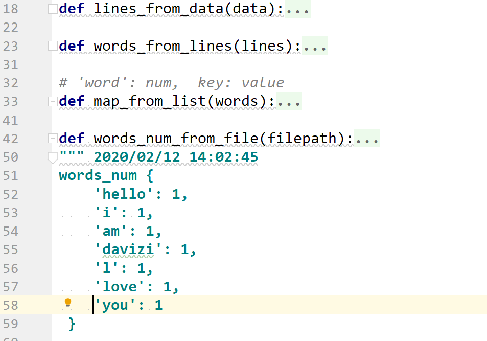

## 大侄子 Python 练习册，每天一个小程序
> 未来的程序员是明日的魔法师

## 项目一
###  图像处理
>  为自己 微信头像 添加数字功能

- 项目展示：
    - 原图：
    
    
    
    - 处理：
    
    
    
- 思路：
    - 新建绘图对象：
        - 开始画图
            - 字体格式和字体大小
            - 坐标
            - 文本信息
            - 颜色
        - 结束画图
            - 删除 draw
        - 保存图片
            - 保存 photo  
            
## 项目二
###  生成激活码
>  生成 200 个激活码（或者优惠券）

 
      
- 思路：
    - 生成 200 个激活码:
        - 生成 1 个激活码
            - 生成 16 位字符:
                - 生成 1 位字符：
                    - 字母
                        - 大写
                        - 小写
                    - 数字
        

## 项目三
###  MySQL 关系型数据库
>   了解学习关系数据库 学会使用插入和查询等基本操作

- 项目展示：
    - 运行结果：
    
    
      
- 思路：
    - 200 个激活码存入MySQL中:
        - 创建数据库文件
        - 创建一个 cursor
        - 创建一个 table
        - 插入数据
            - 获取 200 个数据
                - 插入 200 个数据
                    - 插入一个数据
        - 函数查询数据
        - 用完数据库要关闭
            - 提交事务 
            - 关闭 cursor 
            - 关闭 connection 
   
   
## 项目四
###   文件处理 字符串操作
>   了解学习读取文件 学会正确处理字符串等基本操作

- 项目展示：
    - 运行结果：
    
    
      
- 思路：
    - 读取文件 获取数据
        - filepath 文件路径
        
    - 处理数据
        - lowercase 数据全部变成小写 
        - 处理文件数据 data  
            - 处理 line  
                 - 处理 word
                    - map 含有 key   +1
                    - map 不含有 key  =1 
                    
## 项目五
###   图像处理
>    处理文件中多个图片 改变分辨率 缩小照片

- 项目展示：
    - 运行结果：
    
    - 原图
    
    
    
    - 处理
    
    
    
    
- 思路：
     - images
        - 获取所有图片
            - 处理所有图片
                - 处理一个图片
                    - 改变分辨率
                    - 缩小照片      * 0.9
                    - 保存图片     


## 项目六
###   文件处理 字符串操作
>   了解学习读取文件 学会正确处理字符串等基本操作

- 注意：
    -  map 的类型改变：
    ```python
  map =  {
    "love": 2,
    "i": 3,
    }  
  # 转换成
  list = [
    {
    "word": 'love',
    "time":  2,
    },
    {
    "word": 'str',
    "time":  2,
    },
]
    ```
      
- 思路：
    - 一个目录都是 txt文件：
        - 读取多个 txt文件：
            - 读取一个 txt文件：
                - task_04.py 中写过这个函数   返回结果是  word: times  单词 ： 出现的次数
                    - 处理 map 转换成 list  
                    - 处理 list 找出关键字  
                     - 获取 读出字典内的最大值并提取相应的单词
        

## 项目七
###   文件处理 字符串操作
>   了解学习读取文件 学会正确处理字符串等基本操作

- 项目展示：
    - 运行结果：
    ```buildoutcfg
    2020/02/12 18:16:49 end txt
    2020/02/12 18:16:49 end txt
    2020/02/12 18:16:49 end txt
    2020/02/12 18:16:49 end py
    2020/02/12 18:16:49 codes {'code': 45, 'blank': 14, 'note': 9}
    ```
     
      
- 思路：
    - 读取文件 获取数据
        - filepath 文件路径
        
    - 处理数据
        - files
            - file
                - code
                    - blank 空行 
                    - note  注释 # 
                    - code  代码
                    

## 项目八
###   图片处理
>    生成数字字母验证码图片

- 项目展示：
    - 运行结果：
    
    

      
- 思路：
    - 新建绘图对象：
        - 开始画图
            - 字体格式和字体大小
            - 坐标
            - 背景颜色
            - 文本信息
                - 数字
                    - 颜色
                    - 大小
                - 字母
                    - 颜色
                    - 大小
        - 结束画图
            - 删除 draw
        - 保存图片
            - 保存 photo 
            
    - 生成一个随机 char
    - 生成一个随机 tuple 颜色 rbg

## 项目九
###   图片处理
>    图片滤镜：黑白 马赛克效果 毛玻璃效果等十多种滤镜

- 项目展示：
    - 图片滤镜：
         -  grayscale
        
        
        -  black_white
        
        
        -  negative
        
        
        - frosted_glass
        
        
        -  mosaic
        
        
        -  nostalgia
        
        
        -  comic_books
        
        
        -  brown
        
        
        -  frozen
        
        
        -  fused_cast
        

         -  dark
        
        
         -  mboss
        
        
- 思路：
    - 图片滤镜：
        - 那种滤镜：
            - 获取像素
                - r b g a
                - x y
            - 设置像素
                - r b g a
                

## 项目十
###   数据处理
>    监听用户输入敏感词语

- 项目展示：
    - 运行结果：
    
    

      
- 思路：
    - 读取数据：
        - 读取 filtered_words.txt：
            - lines
                - line
                    - word
                
    - 用户输入词语：
        - 打印出 Freedom
        - 打印出 Human Rights
    
    -  监听  
    
## 项目十一
###   Python 写一个爬虫程序
> 爬取豆瓣 ***TOP250*** 及 数据可视化

- 豆瓣电影 ***top250***:

    - ***type***
    
    

    - ***country***
    
    

    - ***cover***
    

 
- 思路：
    - MVC 模式：
        - model
            - 后端 api python 
            - json 格式保存数据 
    
        - control  
            - 数据处理 
            - 文件处理 提取有用的信息
    
        - view    
            - 数据可视化
            - 自制画图工具 ***painting*** 
    
## 项目十二
###   数据处理
>    监听用户输入敏感词语 并且增加了挑战

- 项目展示：
    - 运行结果：
    
    

      
- 思路：
    - 读取数据：
        - 读取 filtered_words.txt：
            - lines
                - line
                    - word
                
    - 用户输入词语：
        -  替换 **
        -  不替换
    
    -  监听  
    
## 项目十三
###   数据处理
>   student.txt 转换 student.xls
>  处理数据类型  dict
- 项目展示：
    - 运行结果：
    
    

      
- 思路：
    - load_students
    
        - students
        
    - new_of_xls
    
    - wirte_of_students
    
    - save_students
   
## 项目十四
###   数据处理
>   city.txt 转换 city.xls
>  处理数据类型  dict
- 项目展示：
    - 运行结果：
    
    

      
- 思路：
    - load_citys
    
        - citys
        
    - new_of_xls
    
    - wirte_of_citys
    
    - save_citys 

 
## 项目十五
###   数据处理
>   number.txt 转换 number.xls
>  处理数据类型  list
- 项目展示：
    - 运行结果：
    
    

      
- 思路：
    - load_numbers
    
        - numbers
        
    - new_of_xls
    
    - wirte_of_numbers
    
    - save_numbers            
         
                
## 项目十六
###   数据处理
>  1.number.xls  转换 number.xml

>  2.city.xls  转换 city.xml

>  3.处理数据类型  list dict


- 项目展示：
    - 运行结果：
    
    
    
    
     
    

      
- 思路：

    - load_students
        - new_of_student
        - some_students
            - row
            - col
            - sheet_value
    - write_to_xml 
      
## 项目十七
###   数据处理
>   Python 对密码加密

 - 项目展示：
    - 运行结果：
     
- 思路：
     
     
## 项目十八
###   图片处理
>   改变屏幕分辨率

- 直接看代码
   